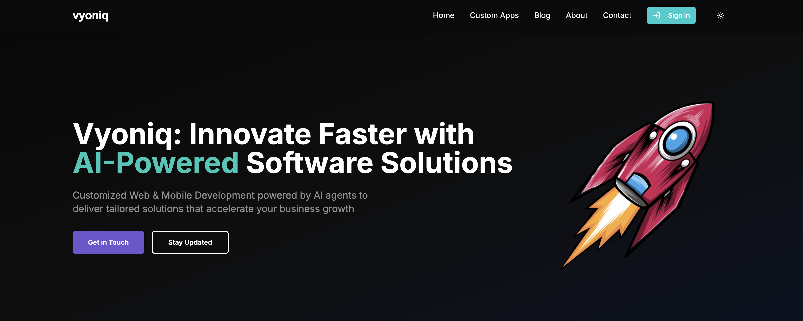
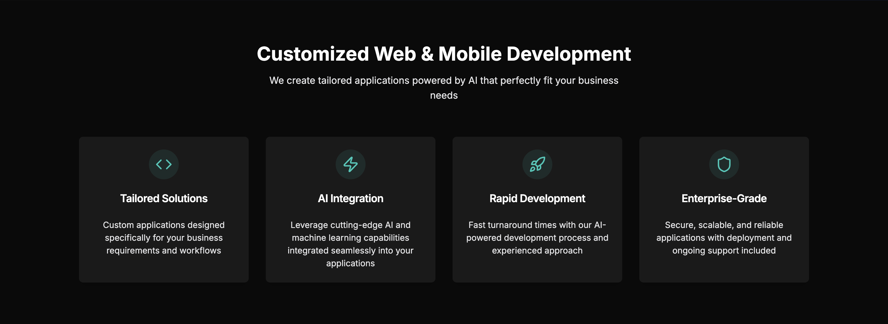
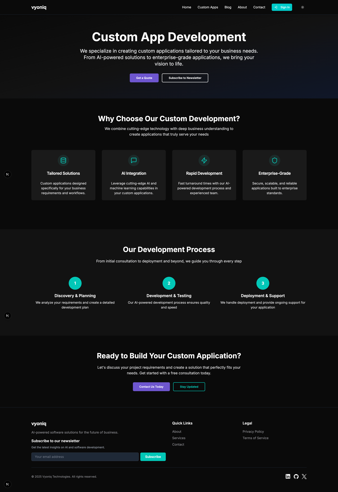
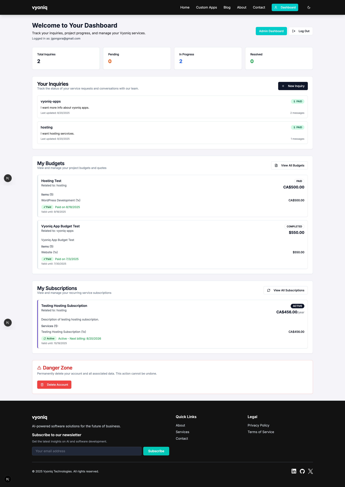
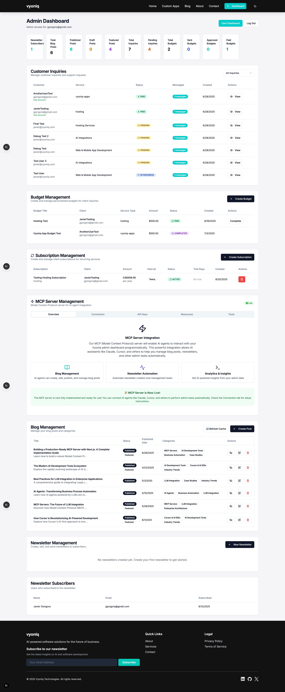
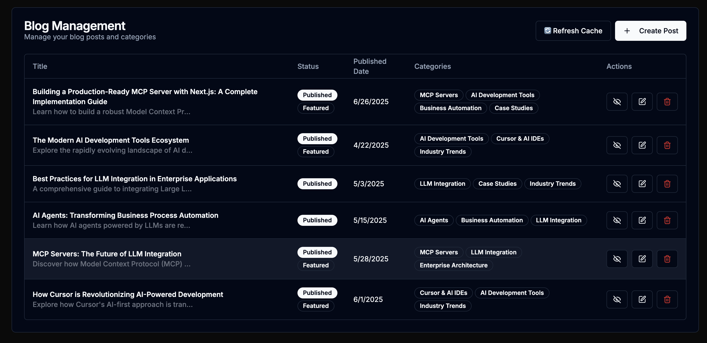
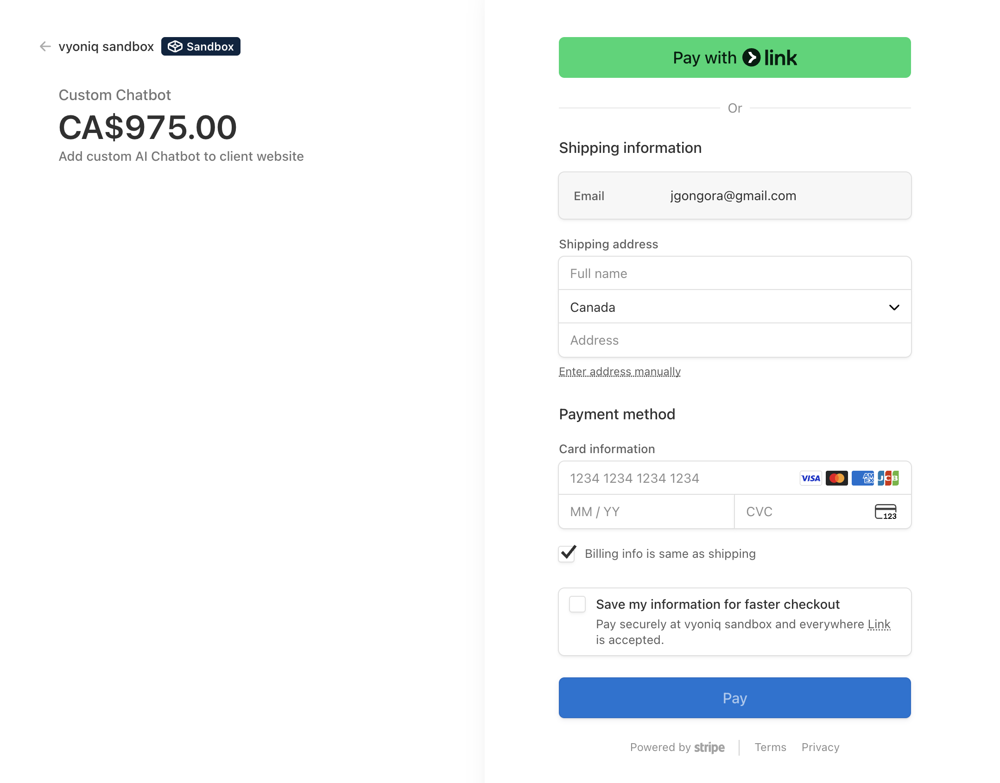
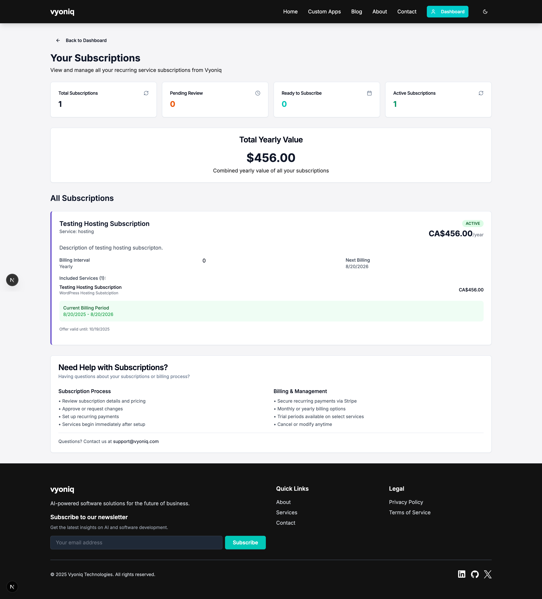
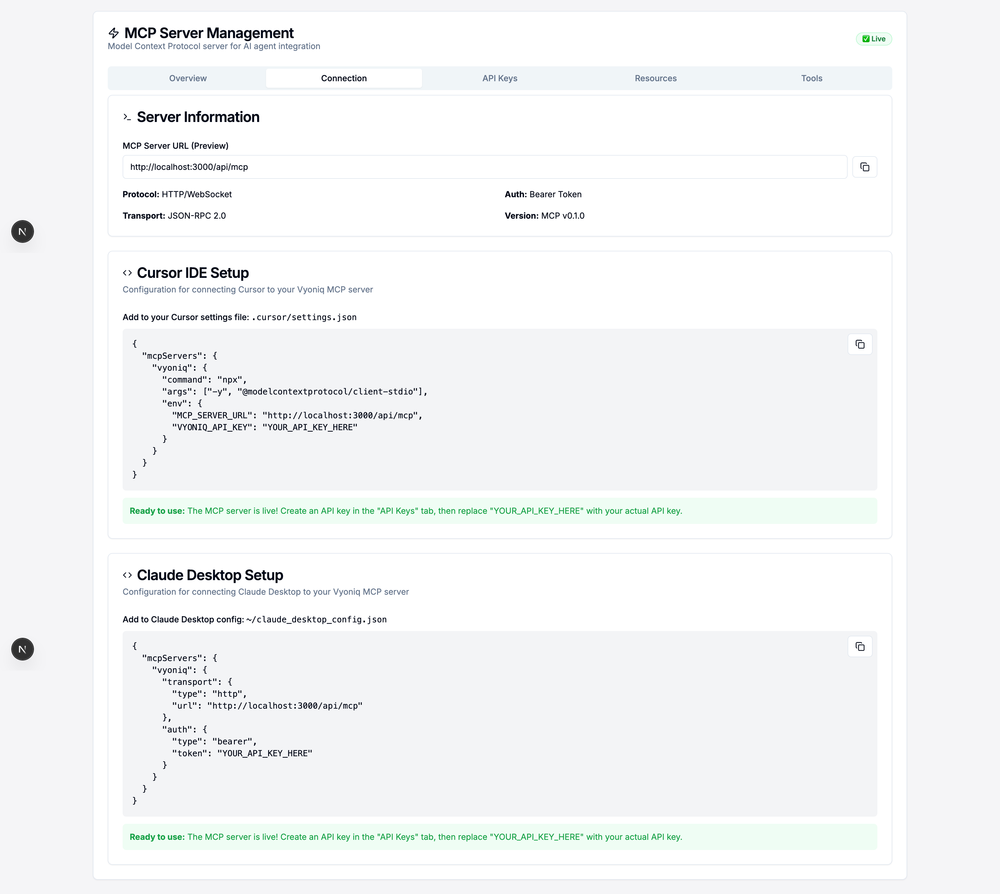

# Vyoniq

[](https://coolify.io/)

> Innovate Faster with AI-Powered Software Solutions

Vyoniq is a modern Software Development company powered by AI agents, delivering innovative solutions with the efficiency of a large team. We specialize in Web and Mobile App Development, secure Hosting Services, and cutting-edge AI Integrations.

This repository contains the source code for the official Vyoniq SaaS platform, featuring a comprehensive landing page, client management system, and AI-powered tools.

## 📸 Screenshots

### Landing Page & Services


_Modern, futuristic landing page with AI-powered design and clear service offerings_


_Comprehensive showcase of Web & Mobile Development, Hosting, and AI Integration services_


_Dedicated section for custom application development services_

### Client Dashboard & Management


_Client dashboard showing inquiries, project status, and subscription management_


_Comprehensive admin dashboard with analytics and management tools_

### Blog & Content Management


_Modern blog with category filtering and responsive design_


_Admin blog management interface with full CRUD operations_

### Payment & Subscription System


_Stripe-integrated payment processing with multi-currency support (USD/CAD)_


_Comprehensive subscription management with billing and trial periods_

### MCP Server Integration


_Model Context Protocol server with AI agent integration for blog and inquiry management_

## ✨ Features

### 🏠 Landing Page & Marketing

- **Modern Hero Section:** Futuristic design with glassmorphism effects and clear value proposition
- **Service Showcase:** Comprehensive display of Web & Mobile Development, Hosting, and AI Integration services
- **Custom Apps Page:** Dedicated section highlighting tailored application development capabilities
- **About Page:** Professional company and founder information
- **Contact System:** Advanced inquiry management with status tracking and email notifications
- **Newsletter System:** Full newsletter management with welcome emails and content distribution
- **SEO Optimized:** Complete SEO implementation with structured data and meta optimization

### 👤 User Management & Authentication

- **Clerk Integration:** Secure authentication with sign-up/sign-in flows
- **User Dashboard:** Personalized dashboard showing project status, inquiries, and subscriptions
- **Profile Management:** User profile editing and account management
- **Role-Based Access:** Admin and user role separation with appropriate permissions
- **Account Deletion:** GDPR-compliant account deletion with data cleanup

### 📊 Admin Dashboard & Analytics

- **Comprehensive Analytics:** Real-time statistics for inquiries, budgets, subscriptions, and blog posts
- **Inquiry Management:** Full CRUD operations for client inquiries with status tracking
- **Budget Management:** Create, send, and track project budgets with approval workflows
- **Subscription Management:** Complete subscription lifecycle management with Stripe integration
- **User Management:** Admin tools for user account management and role assignment
- **Newsletter Management:** Create, send, and track newsletter campaigns

### 💳 Payment & Subscription System

- **Stripe Integration:** Secure payment processing with webhook support
- **Multi-Currency Support:** USD and CAD currency options for global clients
- **Subscription Management:** Recurring billing with trial periods and plan management
- **One-Time Payments:** Budget-based payment system for project-based work
- **Payment Success Pages:** Comprehensive post-payment experience with next steps
- **Automatic Invoicing:** Stripe-powered invoice generation and management

### 📝 Blog & Content Management

- **Full Blog System:** Complete blog with categories, tags, and author management
- **Admin Blog Interface:** Rich admin interface for creating and managing blog content
- **Category Management:** Dynamic category system with post association
- **SEO Features:** Blog-specific SEO optimization with meta tags and structured data
- **Related Posts:** AI-powered related post suggestions
- **Social Sharing:** Built-in social media sharing buttons
- **Responsive Design:** Mobile-optimized blog reading experience

### 🤖 MCP Server & AI Integration

- **Model Context Protocol Server:** Full MCP server implementation for AI agent integration
- **Blog Management Tools:** AI-powered blog creation, editing, and category suggestions
- **Inquiry Management:** Automated inquiry processing and response tools
- **Resource Management:** Dynamic resource resolution for blog posts, categories, and analytics
- **API Authentication:** Dual authentication system (Clerk sessions + API keys)
- **Tool Categories:** Organized tool sets for blog management, inquiry handling, and user management

### 🔧 Technical Features

- **Modern Architecture:** Next.js App Router with TypeScript for type safety
- **Database Integration:** PostgreSQL with Prisma ORM for robust data management
- **Email System:** Resend integration for transactional and marketing emails
- **File Management:** Optimized image handling with Next.js Image component
- **Performance Optimized:** <2s load times with lazy loading and code splitting
- **Accessibility:** WCAG 2.1 compliant with proper ARIA labels and keyboard navigation
- **Dark Mode:** Full dark mode support with theme persistence

## 🚀 Tech Stack

### Frontend & UI

- **Framework:** [Next.js](https://nextjs.org/) (App Router) with TypeScript
- **UI Components:** [shadcn/ui](https://ui.shadcn.com/) for accessible, customizable components
- **Styling:** [Tailwind CSS](https://tailwindcss.com/) with custom design system
- **Icons:** [Lucide React](https://lucide.dev/) for consistent iconography
- **Animations:** CSS animations with Tailwind for smooth interactions

### Backend & Database

- **Database:** [PostgreSQL](https://www.postgresql.org/) with [Prisma ORM](https://prisma.io/)
- **Authentication:** [Clerk](https://clerk.com/) with role-based access control
- **API:** Next.js API routes with TypeScript and Zod validation
- **File Storage:** Next.js optimized image handling

### Payments & Subscriptions

- **Payment Processing:** [Stripe](https://stripe.com/) with webhook integration
- **Multi-Currency:** USD and CAD support
- **Subscription Management:** Recurring billing with trial periods
- **Invoice Generation:** Automated Stripe invoicing

### Email & Communications

- **Email Service:** [Resend](https://resend.com/) for transactional emails
- **Newsletter System:** Custom newsletter management with email templates
- **Notifications:** Real-time status updates and email confirmations

### AI & Integration

- **MCP Server:** Custom Model Context Protocol server implementation
- **AI Tools:** Blog content management and category suggestions
- **API Keys:** Secure API key management for external integrations
- **Webhooks:** Stripe webhook handling for payment events

### Development & Deployment

- **Package Manager:** [pnpm](https://pnpm.io/) for efficient dependency management
- **Type Safety:** Full TypeScript implementation with strict mode
- **Code Quality:** ESLint and Prettier for consistent code formatting
- **Deployment:** [Coolify](https://coolify.io/) on custom VPS with automated CI/CD
- **Monitoring:** Built-in error handling and logging

## 🛠️ Getting Started

Follow these instructions to set up the project locally for development and testing.

### Prerequisites

- [Node.js](https://nodejs.org/en/) (v18.x or later)
- [pnpm](https://pnpm.io/installation) (or `npm`/`yarn`)

### Installation

1.  **Clone the repository:**

    \`\`\`sh
    git clone https://github.com/JaviGong/vyoniq.git
    cd vyoniq
    \`\`\`

2.  **Install dependencies:**

    \`\`\`sh
    pnpm install
    \`\`\`

3.  **Set up environment variables:**

    Create a `.env.local` file in the root of the project. You can copy the `.env.example` file to get started:

    \`\`\`sh
    cp .env.example .env.local
    \`\`\`

    You will need to add your credentials for [Clerk](https://clerk.com/) and connect to your [PostgreSQL](https://www.postgresql.org/) instance.

4.  **Run the development server:**

    \`\`\`sh
    pnpm dev
    \`\`\`

    Open [http://localhost:3000](http://localhost:3000) in your browser to see the result.

## 🤖 MCP Server Integration

Vyoniq features a comprehensive Model Context Protocol (MCP) server that enables AI agents to interact with the platform's data and functionality. The MCP server provides a standardized interface for AI tools to manage content, analyze data, and automate workflows.

### Key Capabilities

- **Blog Management Tools:** AI-powered blog post creation, editing, publishing, and category management
- **Inquiry Processing:** Automated customer inquiry handling with status tracking and response generation
- **Content Analytics:** Real-time analytics and insights for blog performance and user engagement
- **Resource Management:** Dynamic access to blog posts, categories, authors, and system information
- **Dual Authentication:** Supports both Clerk session authentication and API key authentication

### Available Tools

#### Blog Management

- `create_blog_post` - Create new blog posts with metadata and categories
- `update_blog_post` - Edit existing blog content and settings
- `publish_blog_post` - Control blog post publication status
- `delete_blog_post` - Remove blog posts permanently
- `suggest_categories_for_post` - AI-powered category suggestions based on content
- `bulk_update_posts` - Mass operations on multiple blog posts
- `list_blog_posts` - Retrieve blog posts with filtering options
- `get_blog_post` - Get detailed information about specific posts

#### Category Management

- `create_category` - Add new blog categories
- `update_category` - Modify category names and slugs
- `delete_category` - Remove categories with post migration options
- `list_categories` - Get all available categories

#### Inquiry Management

- `list_inquiries` - View customer inquiries with status filtering
- `get_inquiry` - Get detailed inquiry information with conversation history
- `update_inquiry_status` - Change inquiry status (PENDING, IN_PROGRESS, RESOLVED, CLOSED)
- `respond_to_inquiry` - Send responses that automatically email customers
- `create_inquiry` - Create new inquiries for testing
- `get_inquiry_stats` - Get statistics about inquiry statuses

#### System Management

- `delete_user_account` - Admin-only tool for GDPR-compliant account deletion
- `revalidate_blog` - Trigger cache revalidation for updated content

### Resource Access

The MCP server provides structured access to:

- `vyoniq://blog/posts` - All blog posts with metadata
- `vyoniq://blog/posts/{postId}` - Individual blog post content
- `vyoniq://blog/categories` - Category information
- `vyoniq://blog/authors` - Author profiles and statistics
- `vyoniq://server/info` - Server capabilities and information
- `vyoniq://analytics/dashboard` - Admin analytics overview

### Usage with AI Clients

The MCP server is designed to work with AI clients like Cursor IDE, Claude Desktop, and other MCP-compatible tools. It provides a secure, authenticated interface for AI agents to:

1. **Content Creation:** Generate and publish blog posts with proper SEO optimization
2. **Customer Service:** Process and respond to customer inquiries automatically
3. **Content Management:** Organize and categorize content intelligently
4. **Analytics:** Generate insights from blog and user data
5. **Workflow Automation:** Streamline content publishing and customer communication

### API Endpoint

The MCP server is accessible at `/api/mcp` and follows the JSON-RPC 2.0 protocol specification. Authentication is required for all operations, supporting both Clerk sessions and API keys for different use cases.

## 🚢 Deployment & Production

### Deployment Platform

This project is deployed on a custom VPS using [Coolify](https://coolify.io/) for automated deployment and container management. The deployment pipeline provides:

- **Automated CI/CD:** Monitors the `main` branch and triggers deployments on push
- **Container Management:** Docker-based deployment with optimized production builds
- **Environment Management:** Secure environment variable handling and secrets management
- **SSL/TLS:** Automated SSL certificate provisioning and renewal
- **Monitoring:** Built-in application monitoring and health checks

### Production Architecture

- **Application Server:** Next.js production build with optimized static generation
- **Database:** PostgreSQL with automated backups and connection pooling
- **Email Service:** Resend for reliable email delivery with high deliverability
- **Payment Processing:** Stripe with webhook endpoint security
- **File Storage:** Optimized image serving with CDN capabilities
- **Security:** Rate limiting, CORS configuration, and secure headers

### Environment Variables

Required environment variables for deployment:

```bash
# Database
DATABASE_URL=postgresql://...

# Authentication (Clerk)
NEXT_PUBLIC_CLERK_PUBLISHABLE_KEY=pk_...
CLERK_SECRET_KEY=sk_...
CLERK_WEBHOOK_SECRET=whsec_...

# Payments (Stripe)
STRIPE_SECRET_KEY=sk_...
NEXT_PUBLIC_STRIPE_PUBLISHABLE_KEY=pk_...
STRIPE_WEBHOOK_SECRET=whsec_...

# Email (Resend)
RESEND_API_KEY=re_...

# Application
NEXT_PUBLIC_APP_URL=https://vyoniq.com
NEXTAUTH_SECRET=...
MCP_API_SECRET=...
```

### Deployment Process

1. **Code Push:** Changes pushed to `main` branch
2. **Build Trigger:** Coolify detects changes and starts build process
3. **Container Build:** Docker image built with production optimizations
4. **Database Migration:** Prisma migrations applied automatically
5. **Health Checks:** Application health verified before traffic routing
6. **Live Deployment:** New version goes live with zero downtime
7. **Monitoring:** Continuous monitoring for performance and errors

### Performance Optimizations

- **Static Generation:** Blog posts and service pages pre-generated at build time
- **Image Optimization:** Next.js Image component with WebP conversion
- **Code Splitting:** Automatic code splitting for optimal loading
- **Caching:** Aggressive caching strategies for static content
- **Database Optimization:** Query optimization and connection pooling
- **CDN Integration:** Static assets served through optimized delivery network

## 🔌 API Documentation

Vyoniq provides several API endpoints for different functionalities:

### Public APIs

- **Blog Posts:** `/api/blog/posts` - Retrieve published blog posts with filtering
- **Service Pricing:** `/api/service-pricing` - Get current service pricing information
- **Contact Form:** `/api/inquiries` - Submit customer inquiries

### Authenticated APIs (User)

- **User Dashboard:** `/api/user` - Get user profile and dashboard data
- **Inquiries:** `/api/inquiries` - Manage user's inquiries and communications
- **Subscriptions:** `/api/subscriptions` - View and manage user subscriptions
- **Budgets:** `/api/budgets` - Access project budgets and payment information

### Admin APIs (Admin Only)

- **Blog Management:** `/api/admin/blog` - Full CRUD operations for blog content
- **User Management:** `/api/admin/users` - User account management
- **Analytics:** `/api/admin/analytics` - Platform analytics and statistics
- **Newsletter:** `/api/admin/newsletter` - Newsletter management and distribution

### Payment APIs

- **Stripe Checkout:** `/api/payments/create-checkout-session` - Create payment sessions
- **Subscription Billing:** `/api/subscriptions/create-checkout-session` - Handle recurring billing
- **Webhooks:** `/api/webhooks/stripe` - Process Stripe webhook events

### MCP Server

- **MCP Endpoint:** `/api/mcp` - Model Context Protocol server for AI integration
- **Authentication:** Supports both Clerk sessions and API keys
- **Tools:** 20+ tools for blog management, inquiry processing, and analytics
- **Resources:** Dynamic resource access for content and system data

### Email Integration

- **Transactional Emails:** Automated via Resend for confirmations and notifications
- **Newsletter System:** Custom email templates and delivery tracking
- **Webhook Processing:** Real-time email event handling

All APIs use TypeScript with Zod validation for type safety and include proper error handling, rate limiting, and security measures. Authentication is handled via Clerk with role-based access control for admin functions.
